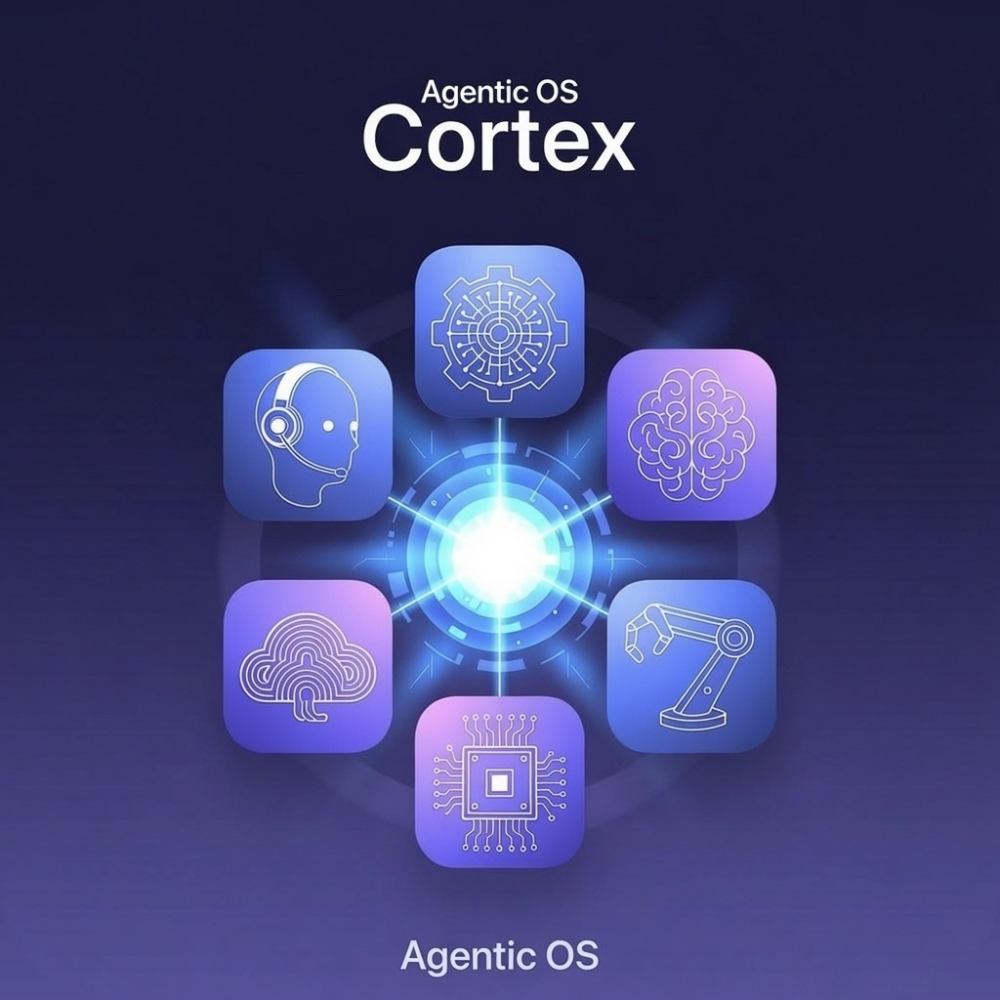

# Cortex

**Agentic OS control plane** for local and cloud AI agents.

Cortex is a unified dashboard and orchestration layer that manages agents and models on your machine, turns rough ideas into multi-agent brainstorms, and runs full build pipelines with shared memory, handoffs, and human approval gates.

| | |
|---|---|
| **Platforms** | macOS desktop app (Apple Silicon) · local web |
| **Style** | Local-first · hybrid cloud + local models |
| **Version** | 0.1.1 (MVP) |
| **License** | See [License](#license) |

<p align="center">
  
</p>

---

## Table of contents

- [What is Cortex?](#what-is-cortex)
- [Features](#features)
- [Installed agents & models](#installed-agents--models)
- [Specification](#specification)
- [Architecture](#architecture)
- [Tech stack](#tech-stack)
- [Install the desktop app](#install-the-desktop-app)
- [Develop from source](#develop-from-source)
- [Configuration](#configuration)
- [Usage guide](#usage-guide)
- [Project structure](#project-structure)
- [API overview](#api-overview)
- [Data & privacy](#data--privacy)
- [Troubleshooting](#troubleshooting)
- [Roadmap](#roadmap)
- [Contributing](#contributing)
- [License](#license)

---

## What is Cortex?

Modern AI work is fragmented across **Claude Code**, **Codex**, **Hermes**, **Grok**, and **LM Studio**. Cortex is the **command center** that sits above them:

1. **See** every agent’s status, roles, metrics, and current work  
2. **Capture** an idea and generate several concrete product concepts  
3. **Execute** a selected concept as a multi-agent pipeline with visible progress  
4. **Control** the flow with pause, resume, reassignment, and approval gates  

The product prioritizes a polished **dark command-center UX**, reliable multi-agent coordination, and running **on your machine** without requiring a cloud-hosted backend.

---

## Features

### Agents
- Registry of installed agents/models with status (`online` / `idle` / `busy` / `error` / `offline`)
- Grouping by **cloud vs local** and role tags (`planner`, `coder`, `researcher`, `critic`, etc.)
- Capabilities, current task, metrics (tokens, latency, success rate)
- Quick actions: start / stop / restart
- Configuration panel: system prompts, model overrides, enable/disable, tool access

### Ideas → Concepts → Projects
- Free-form idea / problem statement input
- Template library (web app, CLI, dashboard, API service, agent workflow, mobile)
- **Generate Concepts**: routes the idea to a brainstorm team and returns **4–8** concrete variations
- One-click **Select & execute** launches the full pipeline as a project

### Collaboration engine
- Strength-based **task routing** per pipeline phase
- Shared **project memory** (phase outputs become inputs for the next)
- Handoffs, parallel-friendly assignment, activity feed
- Human-in-the-loop: approve plans, reject/pause, reassign tasks

### Project workspace
- Live **Kanban** board and pipeline dependency graph
- Artifacts, conversation history, shared memory browser
- Export full project history as JSON
- Basic cost / usage tracking

### Desktop
- Standalone **Electron** app (no external browser required)
- Native window, dock icon, app menu
- Packaged as **`.app`** and **`.dmg`** for macOS (arm64)

---

## Installed agents & models

| Agent | Type | Primary strengths |
|-------|------|-------------------|
| **Hermes** | Local | Research, generalist planning |
| **Claude Code** | Cloud | Architecture, implementation, polish |
| **Codex** | Cloud | Implementation, testing |
| **Grok** (SpaceXAI / xAI) | Cloud | Brainstorm, planning, critique |
| **LM Studio · Qwen** | Local | Offline coding |
| **LM Studio · Llama** | Local | Local analysis / secondary critique |

> **MVP note:** Orchestration and concept generation run with a simulated multi-agent engine (and optional live Grok when `XAI_API_KEY` is set). Real CLI adapters for Hermes / Claude Code / Codex / LM Studio are on the roadmap.

---

## Specification

### Functional requirements (MVP)

| ID | Requirement | Status |
|----|-------------|--------|
| F1 | List agents with status, roles, metrics, actions | ✅ |
| F2 | Group agents by cloud/local and role | ✅ |
| F3 | Activity feed + basic fleet metrics | ✅ |
| F4 | Idea input + template library | ✅ |
| F5 | Multi-agent concept generation (4–8 variants) | ✅ |
| F6 | Select concept → auto-assign pipeline | ✅ |
| F7 | Phases: research → planning → architecture → implementation → testing → polish | ✅ |
| F8 | Kanban + dependency graph with progress | ✅ |
| F9 | Shared memory / artifacts / export | ✅ |
| F10 | Approval gates + pause/resume | ✅ |
| F11 | Agent config UI (prompts, models, keys via env) | ✅ |
| F12 | Dark modern responsive UI | ✅ |
| F13 | Local-first storage (no external DB) | ✅ |
| F14 | Standalone desktop packaging (macOS) | ✅ |

### Pipeline phases

```
research → planning* → architecture* → implementation → testing → polish*
```

`*` = human approval gate by default (can auto-approve in Settings).

### Routing model

Each phase picks an agent using:

- Phase strength scores (0–100)
- Role fit
- Availability (prefer idle over busy)
- Success rate
- Slight preference for **local** agents when scores are close

### Data models

| Entity | Description |
|--------|-------------|
| **Agent** | Identity, type, roles, strengths, status, metrics, config |
| **Idea** | Statement, templates, generated concepts, selection |
| **Concept** | Title, summary, features, stack, difficulty, score |
| **Project** | Concept + tasks, messages, artifacts, shared memory |
| **Task** | Phase unit with agent, progress, dependencies, approval |
| **Artifact** | Named document/code output from a phase |
| **ActivityEvent** | Timeline of starts, handoffs, approvals, errors |
| **UsageRecord** | Tokens, estimated cost, latency |

### Non-functional

- **Local-first:** state on disk; no mandatory cloud backend  
- **Hybrid AI:** works offline via local concept synthesis; optional live Grok  
- **Security:** API keys only via environment / server-side; never bundled into the client  
- **Desktop data path:** `~/Library/Application Support/cortex/data` (macOS packaged app)

---

## Architecture

```
┌──────────────────────────────────────────────────────────────┐
│  UI  ·  Next.js App Router + React 19 + Tailwind             │
│  Command · Agents · Ideas · Projects · Orchestration · Settings│
└────────────────────────────┬─────────────────────────────────┘
                             │  Route Handlers (HTTP API)
┌────────────────────────────▼─────────────────────────────────┐
│  Collaboration engine                                        │
│  · Agent registry + strength-based router                    │
│  · Concept generation (Grok / local synthesis)               │
│  · Pipeline builder + orchestrator tick loop                 │
│  · Shared memory · artifacts · activity bus                  │
└────────────────────────────┬─────────────────────────────────┘
                             │
┌────────────────────────────▼─────────────────────────────────┐
│  Persistence  ·  JSON store (data/state.json)                │
│  Desktop: OS userData · Dev/web: ./data                      │
└──────────────────────────────────────────────────────────────┘

Desktop shell (Electron)
  · Main process starts Next standalone server on 127.0.0.1
  · BrowserWindow loads the local control plane
  · Brand icon from Resources/Cortex.jpg
```

---

## Tech stack

| Layer | Technology |
|-------|------------|
| UI | React 19, Next.js 16 (App Router), TypeScript, Tailwind CSS 4 |
| Icons / UI | lucide-react, custom dark command-center theme |
| API | Next.js Route Handlers |
| Orchestration | In-process TypeScript engine |
| AI (optional) | OpenAI-compatible client → **xAI / SpaceXAI** (`https://api.x.ai/v1`, model `grok-4.5`) |
| Storage | Local JSON file store (no PostgreSQL/SQLite required for MVP) |
| Desktop | Electron 37, electron-builder (DMG / ZIP, macOS arm64) |
| Packaging | Next `output: "standalone"` + post-pack `node_modules` injection |

### npm scripts

| Script | Purpose |
|--------|---------|
| `npm run dev` | Web UI at http://127.0.0.1:3000 |
| `npm run desktop:dev` | Electron window + Next dev (hot reload) |
| `npm run build` | Production Next build |
| `npm run desktop:build` | Build + package macOS `.app` / `.dmg` |
| `npm run lint` | ESLint |

---

## Install the desktop app

### Requirements

- **macOS** on **Apple Silicon** (arm64) for the prebuilt DMG  
- ~3 GB free disk for the installer  
- No Node.js required for end users installing the DMG  

### Steps (end users)

1. Download the latest **`Cortex-*-arm64.dmg`** from [Releases](../../releases)  
   (or build from source — see below).
2. Open the DMG and drag **Cortex** into **Applications**.
3. Launch **Cortex** from Applications or Launchpad.  
4. If macOS blocks an unsigned local build:  
   **Right-click the app → Open → Open**.

### First launch

- Cortex starts a **local-only** server bound to `127.0.0.1` (not exposed to the network by default).
- App data (projects, agents state) is stored under:  
  `~/Library/Application Support/cortex/data`

### Optional: live Grok brainstorming

Concept generation works offline by default. To use live Grok when developing from source, set `XAI_API_KEY` (see [Configuration](#configuration)). Packaged app support for GUI key entry is planned; for now keys are env-based in the server process.

---

## Develop from source

### Requirements

- **Node.js** 20+ (22 recommended)  
- **npm** 10+  
- macOS recommended for desktop packaging  
- Optional: [xAI API key](https://console.x.ai) for live concept generation  

### Clone & install

```bash
git clone https://github.com/<your-org>/Cortex.git
cd Cortex
npm install
cp .env.example .env.local   # optional
```

### Run (web)

```bash
npm run dev
# → http://127.0.0.1:3000
```

### Run (desktop, development)

```bash
npm run desktop:dev
```

Opens a native window pointed at the local Next dev server.

### Build the macOS app

```bash
npm run desktop:build
```

Outputs:

| Artifact | Path |
|----------|------|
| Application | `dist-desktop/mac-arm64/Cortex.app` |
| Disk image | `dist-desktop/Cortex-<version>-arm64.dmg` |
| Zip | `dist-desktop/Cortex-<version>-arm64-mac.zip` |

> **Note:** The packaged app is currently **unsigned**. Users may need **Right-click → Open** the first time. For distribution outside your machine, configure Apple Developer ID signing in electron-builder.

### Verify a package

After building, the app must include Next runtime modules:

```text
Cortex.app/Contents/Resources/standalone/node_modules/next/
```

This is injected by `scripts/after-pack.cjs` (electron-builder otherwise omits `node_modules` from extra resources).

---

## Configuration

### Environment variables

Create `.env.local` (gitignored):

```bash
# SpaceXAI / xAI — enables live Grok concept generation
# https://console.x.ai
XAI_API_KEY=

# Optional future adapters
# ANTHROPIC_API_KEY=
# OPENAI_API_KEY=
```

| Variable | Required | Description |
|----------|----------|-------------|
| `XAI_API_KEY` | No | Live Grok concepts via xAI API |
| `CORTEX_DATA_DIR` | No | Override state directory (set automatically by desktop) |
| `CORTEX_PORT` | No | Packaged server port (default `47832`) |
| `CORTEX_URL` | No | Dev desktop URL (default `http://127.0.0.1:3000`) |

### In-app settings

- Simulation tick speed  
- Auto-approve gates (demo mode)  
- Default LM Studio model name  
- Per-agent enable flag, model string, system prompt  

---

## Usage guide

### Happy path demo

1. Open **Ideas**  
2. Enter a rough problem statement (optionally pick a template)  
3. Click **Generate Concepts**  
4. Review the concept cards and click **Select & execute**  
5. Open the project: watch **Kanban** and the pipeline graph  
6. When a phase hits **awaiting approval**, **Approve** or **Reject**  
7. Browse **Shared memory**, **Artifacts**, and **Export history**  

### Screens

| Route | Purpose |
|-------|---------|
| `/` | Command Center — metrics, live projects, activity |
| `/agents` | Agent fleet, search, filters, controls |
| `/ideas` | Idea capture, templates, concept generation |
| `/projects` | Project list |
| `/projects/[id]` | Workspace: Kanban, memory, artifacts, chat |
| `/orchestration` | Live “who is working on what” |
| `/settings` | Orchestration prefs + agent config |

---

## Project structure

```text
Cortex/
├── Resources/                 # Brand assets (Cortex.jpg)
├── electron/                  # Desktop main + preload
├── scripts/
│   ├── prepare-standalone.cjs # Stage Next standalone runtime
│   └── after-pack.cjs         # Inject node_modules into .app
├── build/                     # Icon assets for packaging (.icns)
├── public/branding/           # Served brand image
├── src/
│   ├── app/                   # Pages + API routes
│   ├── components/            # UI (layout, agents, ideas, projects, …)
│   └── lib/
│       ├── agents/            # Registry + router
│       ├── orchestration/     # Pipeline + engine
│       ├── ai/                # Grok client + phase synthesis
│       ├── store.ts           # Local persistence
│       └── types.ts           # Domain types
├── data/                      # Dev state (gitignored)
├── desktop-runtime/           # Build staging (gitignored)
├── dist-desktop/              # Packaged app output (gitignored)
├── package.json
└── README.md
```

---

## API overview

All routes are local HTTP handlers (same process as the UI in web mode; loopback server in desktop mode).

| Method | Path | Description |
|--------|------|-------------|
| `GET` | `/api/agents` | List agents |
| `PATCH` | `/api/agents/:id` | Update agent / start / stop / restart |
| `GET/POST` | `/api/ideas` | List / create ideas |
| `POST` | `/api/ideas/generate` | Generate concepts |
| `GET/POST` | `/api/projects` | List / create project from concept |
| `GET` | `/api/projects/:id` | Project detail |
| `POST` | `/api/projects/:id/action` | `approve` · `reject` · `pause` · `resume` · `reassign` |
| `GET` | `/api/activity` | Activity feed |
| `GET` | `/api/metrics` | Fleet metrics + usage |
| `GET` | `/api/templates` | App templates |
| `GET/PATCH` | `/api/settings` | App settings |
| `GET` | `/api/export/:id` | Export project JSON |

---

## Data & privacy

- **No cloud database** is required.  
- State is stored as JSON on disk.  
- Optional AI calls (Grok) only happen when `XAI_API_KEY` is configured; idea text is then sent to xAI for concept generation.  
- Without a key, concept generation stays **fully local**.  
- Desktop app listens on **localhost only**.

---

## Troubleshooting

### “Cortex failed to start — Cannot find module 'next'”

You are on an older package that omitted runtime modules. Install **v0.1.1+** built with `scripts/after-pack.cjs`, or rebuild:

```bash
npm run desktop:build
```

### macOS “app is damaged” / cannot be opened

Unsigned local builds can trigger Gatekeeper:

```bash
xattr -cr /Applications/Cortex.app
```

Or **Right-click → Open**.

### Port already in use (dev)

Desktop production uses port **47832**. Dev web uses **3000**. Free the port or set `CORTEX_PORT`.

### Reset local state (dev)

```bash
rm -rf data/state.json
```

Packaged app:

```bash
rm -rf ~/Library/Application\ Support/cortex/data
```

### Desktop window blank

Ensure nothing else is bound to the Cortex port, then relaunch. Use **View → Toggle Developer Tools** for renderer errors.

---

## Roadmap

- [ ] Real CLI / API adapters: Hermes, Claude Code, Codex, LM Studio  
- [ ] SSE / WebSocket activity stream (replace polling)  
- [ ] In-app API key management for packaged desktop  
- [ ] SQLite / libSQL for larger workspaces  
- [ ] Parallel workstreams within a phase  
- [ ] Code signing + notarization for macOS distribution  
- [ ] Windows / Linux desktop targets  
- [ ] Lighter shell option (e.g. Tauri) once adapters stabilize  

---

## Contributing

1. Fork and create a feature branch  
2. `npm install` && `npm run dev`  
3. Keep TypeScript strict; match existing UI patterns (dark command center)  
4. Prefer local-first behavior and never commit secrets (`.env*`)  
5. Open a PR with a clear description and screenshots for UI changes  

### Suggested PR checks

```bash
npm run lint
npm run build
```

For desktop changes, also run `npm run desktop:build` on macOS arm64 and confirm:

```text
dist-desktop/mac-arm64/Cortex.app/Contents/Resources/standalone/node_modules/next
```

exists before tagging a release.

---

## Releasing (maintainers)

1. Bump `version` in `package.json`  
2. `npm run desktop:build`  
3. Smoke-test `dist-desktop/mac-arm64/Cortex.app`  
4. Create a GitHub **Release** and attach:  
   - `Cortex-<version>-arm64.dmg`  
   - `Cortex-<version>-arm64-mac.zip`  
5. Note “unsigned — Right-click → Open on first launch” until notarization is set up  

---

## License

Copyright © Cortex contributors.

This project is provided for local development and evaluation.  
Update this section with your chosen open-source license (e.g. MIT, Apache-2.0) before public release.

```text
SPDX-License-Identifier: UNLICENSED
```

Replace with a proper `LICENSE` file when you publish.

---

## Acknowledgments

- Agent ecosystem: Hermes, Claude Code, Codex, Grok / xAI, LM Studio  
- Built with Next.js, React, Electron, and Tailwind CSS  

---

**Cortex** — one control plane for every agent on your machine.
